# Introduction

As an IT professional with coding experience, diving into Python can feel like a natural next step but may come with
its own challenges, especially if programming logic hasn’t always been your strongest suit. The good news is that 
Python was designed to be simple and readable, making it an ideal language for both beginners and those looking to 
strengthen their coding skills. Its clean syntax mimics everyday language, reducing the intimidation factor that 
comes with more complex languages. 

For someone like you, with a basic understanding of coding, Python offers an excellent environment to grow. It 
encourages you to focus on the logic behind your code rather than getting bogged down in confusing syntax. From 
automating repetitive IT tasks to analyzing logs or even building small apps, Python has the versatility to help you 
accomplish practical goals.

As you get more comfortable, exploring Python's libraries—like `pandas` for data manipulation or `Flask` for web 
development—will open even more doors. Don’t just stop at learning the basics; use your curiosity to investigate how 
Python can fit into your daily IT work or side projects. There are always new tools and tricks to discover, and 
Python’s supportive community makes it easier to learn. Keep asking questions, keep coding, and enjoy the 
process—you’ll be surprised at what you can create.

## Getting started

Hello, fellow tech enthusiast!

If you're ready to start your Python journey, you're in the right place. Python is a fantastic programming language, 
and getting it up and running is super simple—whether you're on Windows, Mac, or Linux.

To get started, head over to the official Python download page: [Download Python](https://www.python.org/downloads/).

After installation, you're all set to start coding!

## Download & Install

Here’s a quick guide for each operating system:

**For Windows:**
1. Download the installer from the link above.
2. When running the installer, make sure to check the box that says "Add Python to PATH" before you hit install.
3. Once installed, open up the Command Prompt (just type `cmd` in your search bar), and type `python` to ensure it's installed properly.

**For Mac:**
1. Mac users, you're in luck—Python often comes pre-installed! To check, open your Terminal and type `python3`.
2. If it’s not installed or you need the latest version, download the installer from the link above, run it, and you’re good to go.

**For Linux:**
1. Python is usually included with most Linux distributions. Just open the terminal and type `python3`.
2. If it’s not there or needs updating, run this command:  
   `sudo apt-get install python3` (for Ubuntu/Debian-based systems).

## Choosing an IDE

**Python IDLE** (Integrated Development and Learning Environment) is the default editor that comes bundled with Python, 
designed to make writing and running Python code simple and beginner-friendly. It offers a graphical interface where 
you can write your code, run it, and even experiment with snippets in real-time.

When you open Python IDLE, you’ll see two main components:

1. *Interactive Shell*: This is the area where you can type Python commands and see immediate results. It’s perfect 
for testing small pieces of code or learning how Python behaves one step at a time. For example, if you type 
`print("Hello, World!")`, the shell will instantly show the output.

2. *Script Editor*: When you’re ready to write longer programs, you can open a new file from the menu 
(File > New File). This brings up the Script Editor, where you can write and save Python programs. You can then run 
your code using the **Run** menu or by pressing `F5`. Any output from your program will appear in the Shell.

IDLE is lightweight, intuitive, and perfect for beginners or anyone looking to quickly test and run Python scripts 
without the need for a full-fledged development environment. It’s a fantastic starting point for writing your first 
Python programs!

**Visual Studio Code** (VS Code) is a popular, free code editor that works great for Python programming. Here are three things that make it stand out:

1. *Extensions*: With the Python extension, VS Code provides powerful features like IntelliSense (code completion), debugging, and linting (code quality checks).
   
2. *Integrated Terminal*: You can run Python scripts directly within VS Code’s terminal without needing to switch between windows, making it efficient for testing and running code.

3. *Customizable*: VS Code is highly customizable with themes, keybindings, and additional extensions for various languages and tools, making it a flexible option for coders of all levels.

It’s an excellent tool if you're looking for a feature-rich environment as you advance in Python!

**PyCharm Community** Edition is a powerful, free IDE tailored specifically for Python development. Here are three great features:

1. *Smart Code Assistance*: PyCharm offers intelligent code completion, error checking, and quick fixes, helping you write clean, error-free Python code faster.

2. *Built-in Debugger*: It comes with an integrated debugger and testing tools, allowing you to troubleshoot and test your Python applications without additional setup.

3. *Project Management*: PyCharm makes it easy to organize and manage larger projects, with support for virtual environments and version control systems like Git.

It's an excellent choice if you're working on more complex Python projects and need a robust, dedicated environment.

## Running programs

At last, we finally will write a program, the classic message `Hello World!`, in Python looks like that:

Code:
```python
print("Hello World!")
```

Output:
```
Hello world!

=== Code Execution Successful ===
```

## Examples

1. Displaying a Welcome Message

```python
# Example 1: Basic welcome message
def welcome_user(name):
    print(f"Welcome, {name}!")

# Call the function
welcome_user("Alice")
```

**Explanation:**

> This example demonstrates a simple function that prints a personalized welcome message using string formatting.

2. Displaying a Multiplication Table

```python
# Example 2: Print a multiplication table for a number
def multiplication_table(number):
    print(f"Multiplication Table for {number}")
    for i in range(1, 11):
        print(f"{number} x {i} = {number * i}")

# Call the function
multiplication_table(5)
```

**Explanation:**

> This function prints the multiplication table of a given number from 1 to 10 using a for loop.

3. Displaying a List of Items

```python
# Example 3: Print items in a list with their index
def display_items(items):
    print("Items in your list:")
    for index, item in enumerate(items, start=1):
        print(f"{index}. {item}")

# Call the function
display_items(["Apple", "Banana", "Orange"])
```

**Explanation:**

> This function takes a list of items and prints them with an index, showing how enumerate() can be used in conjunction with print() to display numbered lists.
> Each of these examples highlights a practical use of print() combined with functions, loops, and string formatting.

Here’s a chart that explains the flow of Example 1:



This chart shows the following steps:

1. *Start*: The function welcome_user("Alice") is called.
2. *Is function called?*: The function takes name = "Alice" as input.
3. *Print step*: The print statement is executed to display "Welcome, Alice!".
4. *End*: The function completes.

## Exercises

Here are three comfortable exercises designed to practice different variations of the print() function,
each exercise progressively introduces new features of the print() function, allowing you to build confidence as you 
learn!

**Exercise 1**: Basic `print()` Function
*Task:* Write a Python program that prints the following sentence:

```
Hello, Alice!

```

*Hint*: Use the `print()` function to display the text.

**Exercise 2**: Using `\n` for Line Breaks
*Task*: Modify your program to print the following text using a single `print()` statement:

```
Hello, world!
How are you today?
```

*Hint*: Use \n to insert a line break between the two sentences.

**Exercise 3**: Using `f-strings` and Variables
*Task*: Write a Python program that asks the user for their name, then prints a personalized greeting. The output should look like this:

```
Hello, Alice! Welcome to Python programming.
```

Hint: Use an `f-string` and a variable to dynamically insert the user's name into the message.

**Solutions**:

*Example 1 solution*:

```python
print("Hello, world!")
```

*Example 2 solution*:

```python
print("Hello, world!\nHow are you today?")
```

*Example 3 solution*:

```python
name = input("What is your name? ")
print(f"Hello, {name}! Welcome to Python programming.")
```

Now you are a **programmer**, what would you do next?

---

| Go back | Next.. |
|---------|--------|
| [Table of Contents](../index.md) | [Chapter 2](chapters/chapter_2.md) |